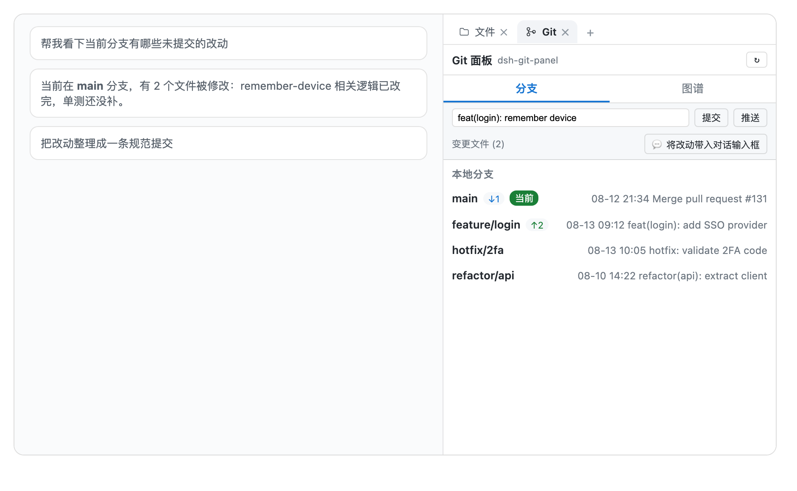

# dsh-git-panel

[中文](README.md) · [English](README.en.md)

Un plugin de panel de Git para la GUI web de DSH: gestión de ramas (cambiar / traer cambios / obtener / renombrar / eliminar / fusionar) más un gráfico de commits estilo GitLens.

## Características

- **Panel de ramas** (lado derecho del chat):
  - **Diseño de tarjeta en dos filas**: los nombres de rama ocupan la fila superior completa sin truncarse, y la información del commit se sitúa en una segunda fila dedicada
  - **Búsqueda y filtrado rápido**: cuadro de búsqueda en la parte superior para filtrar ramas y mensajes de commit en tiempo real
  - Ramas locales: rama actual resaltada, `↑adelante / ↓detrás` respecto a la rama remota, **doble clic para cambiar** (doble clic en la rama actual para traer cambios)
  - Ramas remotas: **doble clic para cambiar a** (crea automáticamente una rama de seguimiento local)
  - Menú contextual: **copiar nombre de rama / renombrar / eliminar / fusionar en la rama actual** (las ramas remotas ofrecen eliminar rama remota)
  - **Traer cambios** de la rama actual con un clic, **obtener todo** (`git fetch --all --prune`)
- **Chip de rama** (encima del cuadro de entrada): muestra la rama actual; haz clic para abrir la lista de ramas locales y cambiar rápidamente
- **Gráfico de Git**: carriles del DAG de commits, encabezado de tres columnas (Carriles / Commit / Rama); la columna de commits se puede redimensionar desde ambos lados (ancho persistente); haz clic en un nodo para ver los detalles del commit; renderizado virtualizado — solo se dibuja el área visible, por lo que los repositorios grandes se desplazan con fluidez
- **Barra de escritura** (parte superior del panel, bajo las pestañas):
  - **Confirmar (commit)**: escriba un mensaje y pulse Enter → `git add -A && git commit -m`
  - **Empujar (push)**: `git push` de la rama actual con un clic
  - **Guardar / recuperar (stash)**: `git stash push` (mensaje opcional) / `git stash pop`
  - **Estado**: muestra el número de archivos modificados (`git status --porcelain`)
- **Cambios + Diff coloreado**: los archivos modificados sin confirmar se listan bajo la barra de escritura (código de estado + ruta); haga clic en un archivo para ver su diff completo contra HEAD con líneas coloreadas (+ verde para adiciones, - rojo para eliminaciones, @@ azul para bloques) — revise los cambios con claridad antes de confirmar
- **Inyección de contexto en el chat con un clic**:
  - **Enviar cambios al chat**: haga clic en "💬 Enviar cambios al chat" en el encabezado de cambios para generar un mensaje estructurado con los archivos modificados y solicitar al agente revisiones o mensajes de confirmación
  - **Acciones por archivo**: cada archivo incluye "📋 Copiar ruta relativa", "💬 Preguntar al Agente sobre este archivo" y "↩️ Descartar cambios" con confirmación de seguridad
  - **Enviar diff al chat**: haga clic en "💬 Enviar diff al chat" dentro del visor de diff para enviar las diferencias exactas al cuadro de chat
- **Acciones sobre commits del gráfico**: haga clic en un nodo de commit del gráfico para **cherry-pick a la rama actual** o **revertirlo** (`git revert --no-edit`)
- **Multilingüe**: sigue el idioma de la interfaz web de DSH (chino / inglés); los navegadores en español reciben automáticamente el texto en español; por defecto chino simplificado
- **Pestaña nativa en la barra lateral derecha**: el panel Git es una pestaña de primera clase junto a «Archivos»; expandir, contraer, arrastrar el ancho y cambiar de pestaña los gestiona la barra lateral oficial, sin reescribir el diseño de la página
- Sigue el directorio de trabajo de la sesión actual: se reenlaza automáticamente al cambiar de sesión de proyecto
- Tema claro / oscuro siguiendo la GUI web de DSH

## Capturas de pantalla

**Pestaña nativa en la barra lateral derecha** — Git aparece junto a la pestaña integrada «Archivos»; la barra lateral gestiona expandir/contraer, el ancho y el cambio de pestañas:



**Panel de ramas** (ramas locales/remotas, adelante/detrás, doble clic para cambiar, menú contextual):


**Chip de rama** (cambio rápido de rama encima del cuadro de entrada):


**Gráfico de commits** (columnas redimensionables, scroll virtualizado):


## Instalación

```sh
dsh plugin --profile web add dsh-git-panel
```

Reinicia `dsh web`, abre una sesión de proyecto vinculada a un repositorio git, abre la barra lateral derecha (arriba a la derecha) y elige la pestaña **Git**.

> Requiere DSH `>=0.1.5-alpha.1` (la versión que introdujo el marco de pestañas laterales derechas `@deepseek-ai/dsh-client-ui-sidebar-right`).

> Para desarrollo local, instala mediante un enlace: `dsh plugin --profile web add link:/path/to/dsh-git-panel`. Tras editar el código, ejecuta `npm run build` y actualiza la página para ver los cambios.

## Comentarios

¿Encontró un error o tiene una sugerencia? Abra un issue en [GitHub Issues](https://github.com/a792883583/dsh-git-panel/issues) — sus comentarios nos ayudan a mejorar el plugin.

## Licencia

MIT
