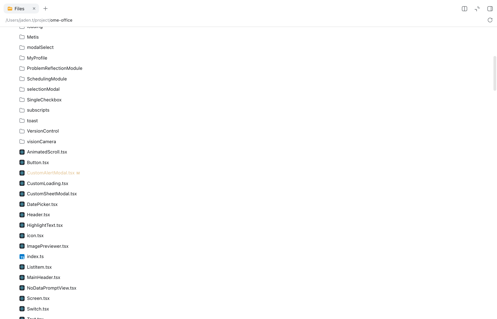
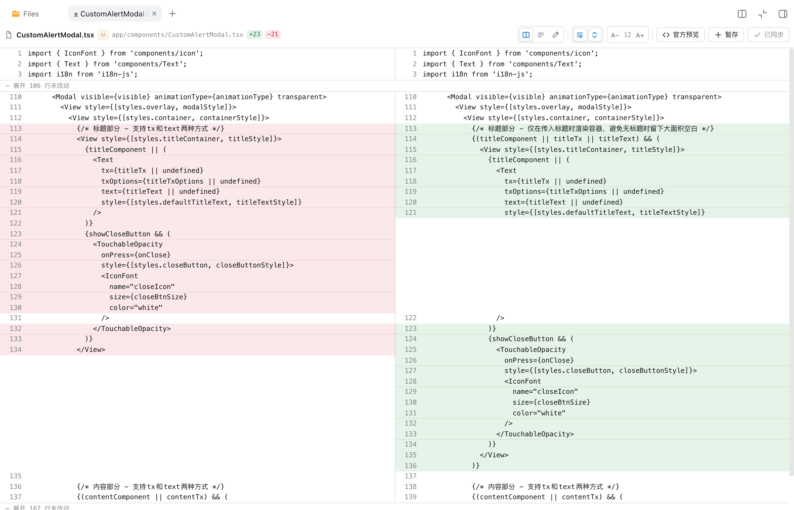
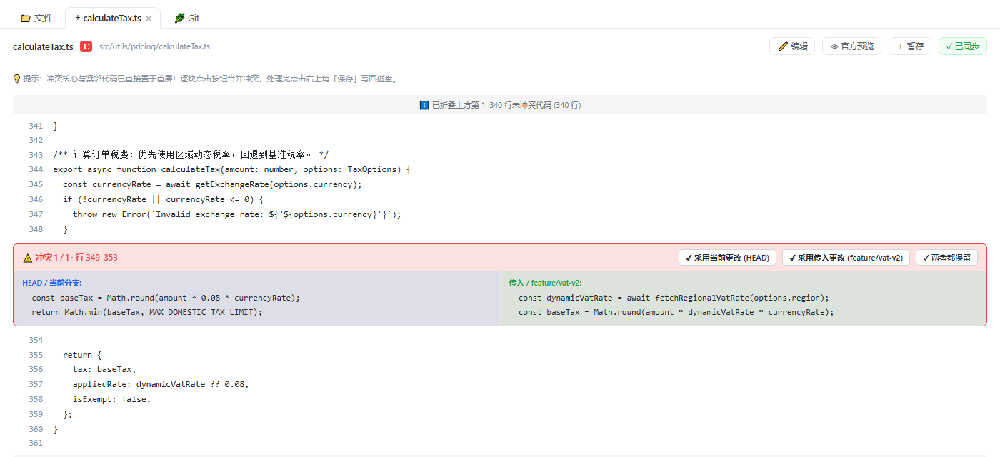

# dsh-git-panel

[English](README.en.md) · [Español](README.es.md)

DSH Web GUI 的 Git 面板插件：分支管理（切换 / 拉取 / 抓取 / 重命名 / 删除 / 合并）+ GitLens 风格的提交图谱。

## 功能

- **分支面板**（聊天区右侧）：
  - **双行卡片式布局**：分支名占据完整上行空间（超长分支名不再被挤压截断），提交时间与 Commit 信息位于独立下半行
  - **搜索与快速过滤**：分支列表顶部配备实时搜索框，支持按分支名或提交信息快速过滤
  - 本地分支：当前分支高亮，显示相对上游的 `↑ahead / ↓behind`，**双击切换分支**（当前分支双击为拉取）
  - 远程分支：**双击检出**（自动创建本地跟踪分支）
  - 右键菜单：**复制分支名 / 重命名 / 删除 / 合并至当前分支**（远程分支为删除远程分支）
  - 一键**拉取**当前分支、**全部抓取**（`git fetch --all --prune`）
- **分支胶囊**（输入框上方）：显示当前分支，点击展开本地分支列表快速切换
- **Git 图谱**：提交 DAG 泳道图（lane 算法），三栏标题（线图 / 提交 / 分支），提交列左右两侧可拖拽调宽（宽度持久化），点击节点查看提交详情；虚拟化渲染——只绘制可视区域，大仓库滚动流畅
- **写操作条**（面板顶部，位于标签页下方）：
  - **提交**：输入提交信息回车即 `git add -A && git commit -m`
  - **推送**：一键 `git push` 当前分支
  - **暂存 / 恢复暂存**：`git stash push`（可带说明）/ `git stash pop`
  - **状态**：显示当前工作区变更文件数（`git status --porcelain`）
- **变更文件 + 行内着色 Diff**：写操作条下方列出未提交的变更文件（状态码 + 路径），点击任意文件查看与 HEAD 的完整 diff，新增行（绿色 +）、删除行（红色 -）与块头（蓝色 @@）带精细高亮——提交前清晰审核改动
- **文件树改动标记（VS Code 观感）**：右侧栏「文件」树里，有改动的文件名后直接跟状态字母并给名字上色（`M` 修改 / `A` 新增 / `U` 未跟踪 / `D` 删除 / `R` 重命名 / `C` 冲突），含改动的目录带一个圆点；标记跟随 `git status` 自动刷新，不需要手动刷新文件树
- **Git 对比视图（VS Code 风格双栏 Diff）**：在有改动的文件上点一下，直接在右侧栏打开该文件的变更对比
  - 左栏是 HEAD 原始版本、右栏是工作区最新内容，行号严格对齐，新增 / 删除 / 修改行分别着色
  - 支持**单栏 / 双栏**切换、**折叠未改动区域**（默认保留 3 行上下文，点击展开）、**自动换行**开关、**字号缩放**，以及**直接编辑**文件内容
  - 头部显示 `+新增 / −删除` 统计；「源码」一键回到官方文本预览，「暂存」一键 `git add`，「保存」把改动写回工作区
  - 只有**确有改动**的文件会被这个视图接手，没有改动的文件仍然使用官方预览，两者互不干扰
- **合并冲突一键解决（全景行号上下文流）**：
  - 首屏天然置于冲突核心，前后紧邻保留 8 行清晰代码上下文，远处无关代码折叠为可展开条，行号绝对连贯
  - 自动识别 `<<<<<<<` / `=======` / `>>>>>>>` 冲突块，每块提供 **「✔ 采用当前更改」**、**「✔ 采用传入更改（分支名）」**、**「✔ 两者都保留」** 三个一键动作
  - 处理完毕点击右上角「保存并解决冲突」直接写回工作区并移出冲突态
- **免终端原位凭据保存（VS Code 式体验）**：
  - 遇到企业私有 GitLab / GitHub 缺少凭据时，面板内原位弹出优雅配置卡片，输入一次自动记住，终生免密直连，绝不再报 OAuth 弹窗阻断
- **VS Code 级智能无感同步（Sync）**：
  - 仅超前时直接极速 push，有落后时才执行安全 pull，彻底废除强制 `--rebase`，绝无变基死锁冲突
  - 自动脱离残留的变基中间态（自动 `rebase --abort` 救援）
- **会话上下文一键智能注入**：
  - **情境感知 Prompt 引擎**：检测到冲突时，按钮自动切换为「💬 将冲突分析带入对话」，一键生成针对该冲突文件的专业排查指令；无冲突时生成 Commit 审查指令，全面支持中/英/西三语
  - **最新 Lexical 编辑器完美兼容**：全面适配 DSH Web 最新的富文本输入框，点击秒级填入
  - **单文件精准操作**：每个暂存/未暂存文件均提供「📋 复制相对路径」、「💬 向 Agent 提问此文件」以及未暂存文件的「↩️ 放弃更改 (Discard)」二次确认回滚操作
- **分支极速更新与并发防重入**：
  - 本地分支右侧的落后（`↓101`）胶囊徽章支持直接点击一键拉取
  - 右键菜单集成「⬇️ 拉取更新 (Pull)」与「🔄 抓取全部 (Fetch all)」，支持严格防重入锁与「✕ 取消」操作
- **图谱提交操作**：点击图谱中的提交节点，可一键 **cherry-pick 到当前分支** 或 **撤销该提交**（`git revert --no-edit`）
- **多语言**：自动跟随 DSH Web 界面语言（中文 / 英文），西班牙语浏览器自动切换西班牙语，默认简体中文
- **官方右侧栏原生标签页**：Git 面板作为右侧栏的一等公民标签与「文件」并列，展开、收起、宽度拖拽、多标签切换全部由官方侧边栏接管，不再改写页面布局
- 跟随当前会话工作目录：切换项目会话自动重新绑定
- 明暗主题跟随 DSH Web GUI

## 界面预览

**文件树改动标记**（有改动的文件名后跟状态字母并着色，含改动的目录带圆点，与 VS Code 资源管理器一致）：



**Git 对比视图**（全屏双栏 Diff，行号对齐，未改动区域可折叠，头部含增删统计与操作按钮）：



**合并冲突一键解决**（逐块并排展示两侧内容，三个动作直接落笔，保存即写回）：



**官方右侧栏原生标签页**（与内置「文件」并列，展开/收起、宽度拖拽、标签切换全部由官方侧边栏接管）：


**分支面板**（本地/远程分支、ahead/behind、双击切换、右键菜单）：


**分支胶囊**（输入框上方快速切换分支）：


**提交图谱**（三栏可拖拽列宽、虚拟化滚动）：


## 安装

```sh
dsh plugin --profile web add dsh-git-panel
```

重启 `dsh web`，打开绑定 git 仓库的项目会话，然后点开右上角的右侧栏，选择 **Git** 标签页。

> **运行环境要求**：需要 **当前这套 DSH Web**（`>=0.1.5-alpha.1`，即带官方右侧栏多标签框架 `@deepseek-ai/dsh-client-ui-sidebar-right` 的版本）。
> 文件树改动标记、Git 对比标签依赖右侧栏的标签类型注册与文件资源地址；「在官方文件预览里手动切换到 Git 变更对比」还依赖 DSH 自带的 `@deepseek-ai/dsh-client-ui-sidebar-documentpreview`（0.1.5 起的官方 web bundle 默认包含）。
> 在更早的 DSH（例如 `0.1.2-rc.1`）上这些能力不会生效——那些版本没有右侧栏标签注册表，也没有统一的 `dsh-resource://file` 地址模型。

> 本地开发时可用 `dsh plugin --profile web add link:/path/to/dsh-git-panel` 以链接方式安装，修改源码后 `npm run build` 并刷新页面即可生效。

## 反馈

使用中遇到问题或有功能建议？欢迎到 [GitHub Issues](https://github.com/a792883583/dsh-git-panel/issues) 反馈，帮助我们把插件做得更好。

## License

MIT
