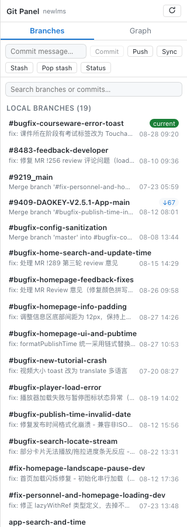
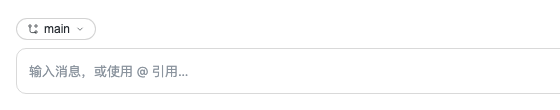
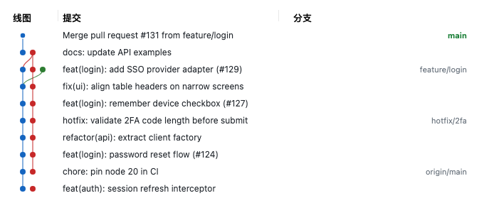

# dsh-git-panel

[English](README.en.md) · [Español](README.es.md)

DSH Web GUI 的 Git 面板插件：分支管理（切换 / 拉取 / 抓取 / 重命名 / 删除 / 合并）+ GitLens 风格的提交图谱。

## 功能

- **分支面板**（聊天区右侧）：
  - 本地分支：当前分支高亮，显示相对上游的 `↑ahead / ↓behind`，**双击切换分支**（当前分支双击为拉取）
  - 远程分支：**双击检出**（自动创建本地跟踪分支）
  - 右键菜单：**重命名 / 删除 / 合并至当前分支**（远程分支为删除远程分支）
  - 一键**拉取**当前分支、**全部抓取**（`git fetch --all --prune`）
- **分支胶囊**（输入框上方）：显示当前分支，点击展开本地分支列表快速切换
- **Git 图谱**：提交 DAG 泳道图（lane 算法），三栏标题（线图 / 提交 / 分支），提交列左右两侧可拖拽调宽（宽度持久化），点击节点查看提交详情；虚拟化渲染——只绘制可视区域，大仓库滚动流畅
- **写操作条**（面板顶部，位于标签页下方）：
  - **提交**：输入提交信息回车即 `git add -A && git commit -m`
  - **推送**：一键 `git push` 当前分支
  - **暂存 / 恢复暂存**：`git stash push`（可带说明）/ `git stash pop`
  - **状态**：显示当前工作区变更文件数（`git status --porcelain`）
- **多语言**：自动跟随 DSH Web 界面语言（中文 / 英文），西班牙语浏览器自动切换西班牙语，默认简体中文
- 跟随当前会话工作目录：切换项目会话自动重新绑定
- 明暗主题跟随 DSH Web GUI

## 界面预览

**分支面板**（本地/远程分支、ahead/behind、双击切换、右键菜单）：



**分支胶囊**（输入框上方快速切换分支）：



**提交图谱**（三栏可拖拽列宽、虚拟化滚动）：



## 安装

```sh
dsh plugin --profile web add dsh-git-panel
```

重启 `dsh web`，打开绑定 git 仓库的项目会话，聊天区右侧出现「Git 面板」。

> 本地开发时可用 `dsh plugin --profile web add link:/path/to/dsh-git-panel` 以链接方式安装，修改源码后 `npm run build` 并刷新页面即可生效。

## License

MIT
